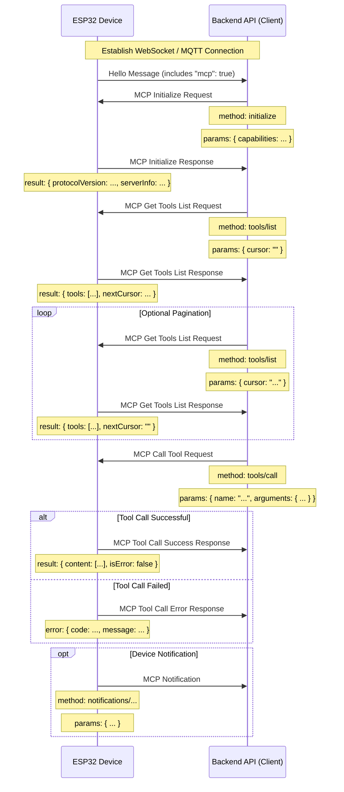
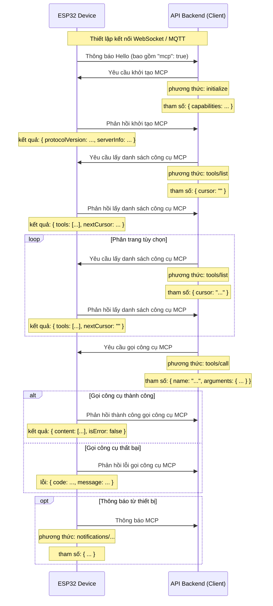

# MCP (Model Context Protocol) Interaction Flow

NOTICE: AI-assisted generation. When implementing the backend service, please refer to the code for specific details!

The MCP protocol in this project is used for communication between the backend API (MCP client) and ESP32 devices (MCP server), allowing the backend to discover and invoke functions (tools) provided by the device.

## Protocol Format

According to the code (`main/protocols/protocol.cc`, `main/mcp_server.cc`), MCP messages are encapsulated within the message body of a basic communication protocol (such as WebSocket or MQTT). Its internal structure follows the [JSON-RPC 2.0](https://www.jsonrpc.org/specification) specification.

Overall message structure example:

```json
{
  "session_id": "...", // Session ID
  "type": "mcp",       // Message type, fixed as "mcp"
  "payload": {         // JSON-RPC 2.0 payload
    "jsonrpc": "2.0",
    "method": "...",   // Method name (e.g., "initialize", "tools/list", "tools/call")
    "params": { ... }, // Method parameters (for request)
    "id": ...,         // Request ID (for request and response)
    "result": { ... }, // Method execution result (for success response)
    "error": { ... }   // Error information (for error response)
  }
}
```

The `payload` section is a standard JSON-RPC 2.0 message:

- `jsonrpc`: Fixed string "2.0".
- `method`: The name of the method to be invoked (for Request).
- `params`: Parameters for the method, a structured value, usually an object (for Request).
- `id`: Identifier for the request, provided by the client when sending the request, and returned as-is by the server in the response. Used to match requests and responses.
- `result`: The result of successful method execution (for Success Response).
- `error`: Error information when method execution fails (for Error Response).

## Interaction Flow and Sending Timing

MCP interaction primarily revolves around the client (backend API) discovering and invoking "Tools" on the device.

1.  **Connection Establishment and Capability Announcement**

    - **Timing:** After the device starts and successfully connects to the backend API.
    - **Sender:** Device.
    - **Message:** The device sends a basic protocol "hello" message to the backend API, containing a list of capabilities supported by the device, for example, by supporting the MCP protocol (`"mcp": true`).
    - **Example (not MCP payload, but basic protocol message):**
      ```json
      {
        "type": "hello",
        "version": ...,
        "features": {
          "mcp": true,
          ...
        },
        "transport": "websocket", // or "mqtt"
        "audio_params": { ... },
        "session_id": "..." // Device may set after receiving server hello
      }
      ```

2.  **Initialize MCP Session**

    - **Timing:** After the backend API receives the device's "hello" message and confirms that the device supports MCP, typically sent as the first request of an MCP session.
    - **Sender:** Backend API (client).
    - **Method:** `initialize`
    - **Message (MCP payload):**

      ```json
      {
        "jsonrpc": "2.0",
        "method": "initialize",
        "params": {
          "capabilities": {
            // Client capabilities, optional

            // Camera vision related
            "vision": {
              "url": "...", // Camera: image processing address (must be http address, not websocket address)
              "token": "..." // url token
            }

            // ... Other client capabilities
          }
        },
        "id": 1 // Request ID
      }
      ```

    - **Device Response Timing:** After the device receives and processes the `initialize` request.
    - **Device Response Message (MCP payload):**
      ```json
      {
        "jsonrpc": "2.0",
        "id": 1, // Match request ID
        "result": {
          "protocolVersion": "2024-11-05",
          "capabilities": {
            "tools": {} // The tools here do not seem to list detailed information, requires tools/list
          },
          "serverInfo": {
            "name": "...", // Device name (BOARD_NAME)
            "version": "..." // Device firmware version
          }
        }
      }
      ```

3.  **Discover Device Tool List**

    - **Timing:** When the backend API needs to obtain a list of specific functions (tools) currently supported by the device and their invocation methods.
    - **Sender:** Backend API (client).
    - **Method:** `tools/list`
    - **Message (MCP payload):**
      ```json
      {
        "jsonrpc": "2.0",
        "method": "tools/list",
        "params": {
          "cursor": "" // For pagination, empty string for the first request
        },
        "id": 2 // Request ID
      }
      ```
    - **Device Response Timing:** After the device receives the `tools/list` request and generates the tool list.
    - **Device Response Message (MCP payload):**
      ```json
      {
        "jsonrpc": "2.0",
        "id": 2, // Match request ID
        "result": {
          "tools": [ // List of tool objects
            {
              "name": "self.get_device_status",
              "description": "...",
              "inputSchema": { ... } // Parameter schema
            },
            {
              "name": "self.audio_speaker.set_volume",
              "description": "...",
              "inputSchema": { ... } // Parameter schema
            }
            // ... More tools
          ],
          "nextCursor": "..." // If the list is large and requires pagination, this will contain the cursor value for the next request
        }
      }
      ```
    - **Pagination Handling:** If the `nextCursor` field is not empty, the client needs to send another `tools/list` request with this `cursor` value in `params` to get the next page of tools.

4.  **Invoke Device Tool**

    - **Timing:** When the backend API needs to execute a specific function on the device.
    - **Sender:** Backend API (client).
    - **Method:** `tools/call`
    - **Message (MCP payload):**
      ```json
      {
        "jsonrpc": "2.0",
        "method": "tools/call",
        "params": {
          "name": "self.audio_speaker.set_volume", // Name of the tool to invoke
          "arguments": {
            // Tool parameters, object format
            "volume": 50 // Parameter name and its value
          }
        },
        "id": 3 // Request ID
      }
      ```
    - **Device Response Timing:** After the device receives the `tools/call` request and executes the corresponding tool function.
    - **Device Success Response Message (MCP payload):**
      ```json
      {
        "jsonrpc": "2.0",
        "id": 3, // Match request ID
        "result": {
          "content": [
            // Tool execution result content
            { "type": "text", "text": "true" } // Example: set_volume returns bool
          ],
          "isError": false // Indicates success
        }
      }
      ```
    - **Device Failure Response Message (MCP payload):**
      ```json
      {
        "jsonrpc": "2.0",
        "id": 3, // Match request ID
        "error": {
          "code": -32601, // JSON-RPC error code, e.g., Method not found (-32601)
          "message": "Unknown tool: self.non_existent_tool" // Error description
        }
      }
      ```

5.  **Device Actively Sends Messages (Notifications)**
    - **Timing:** When an event occurs internally on the device that needs to notify the backend API (e.g., state changes, although the code example does not explicitly show tools sending such messages, the existence of `Application::SendMcpMessage` implies that the device may actively send MCP messages).
    - **Sender:** Device (server).
    - **Method:** May be a method name starting with `notifications/`, or other custom methods.
    - **Message (MCP payload):** Follows JSON-RPC Notification format, without an `id` field.
      ```json
      {
        "jsonrpc": "2.0",
        "method": "notifications/state_changed", // Example method name
        "params": {
          "newState": "idle",
          "oldState": "connecting"
        }
        // No id field
      }
      ```
    - **Backend API Handling:** After receiving a Notification, the backend API performs corresponding processing but does not reply.

## Interaction Diagram

Below is a simplified interaction sequence diagram showing the main MCP message flow:



This document outlines the main interaction flow of the MCP protocol in this project. Specific parameter details and tool functionalities need to refer to `McpServer::AddCommonTools` in `main/mcp_server.cc` and the implementation of each tool.

---

# Luồng tương tác giao thức MCP (Model Context Protocol)

LƯU Ý: Được tạo bởi AI, khi triển khai dịch vụ backend, vui lòng tham khảo mã để xác nhận chi tiết!

Giao thức MCP trong dự án này được sử dụng để giao tiếp giữa API backend (client MCP) và các thiết bị ESP32 (máy chủ MCP), cho phép backend khám phá và gọi các chức năng (công cụ) do thiết bị cung cấp.

## Định dạng giao thức

Theo mã (`main/protocols/protocol.cc`, `main/mcp_server.cc`), các thông báo MCP được đóng gói trong phần thân thông báo của một giao thức giao tiếp cơ bản (chẳng hạn như WebSocket hoặc MQTT). Cấu trúc bên trong của nó tuân theo đặc tả [JSON-RPC 2.0](https://www.jsonrpc.org/specification).

Ví dụ cấu trúc thông báo tổng thể:

```json
{
  "session_id": "...", // ID phiên
  "type": "mcp",       // Loại thông báo, cố định là "mcp"
  "payload": {         // Tải trọng JSON-RPC 2.0
    "jsonrpc": "2.0",
    "method": "...",   // Tên phương thức (ví dụ: "initialize", "tools/list", "tools/call")
    "params": { ... }, // Tham số phương thức (cho yêu cầu)
    "id": ...,         // ID yêu cầu (cho yêu cầu và phản hồi)
    "result": { ... }, // Kết quả thực thi phương thức (cho phản hồi thành công)
    "error": { ... }   // Thông tin lỗi (cho phản hồi lỗi)
  }
}
```

Phần `payload` là một thông báo JSON-RPC 2.0 tiêu chuẩn:

- `jsonrpc`: Chuỗi cố định "2.0".
- `method`: Tên của phương thức sẽ được gọi (cho Yêu cầu).
- `params`: Các tham số cho phương thức, một giá trị có cấu trúc, thường là một đối tượng (cho Yêu cầu).
- `id`: Định danh cho yêu cầu, được client cung cấp khi gửi yêu cầu và được máy chủ trả về nguyên trạng trong phản hồi. Được sử dụng để khớp yêu cầu và phản hồi.
- `result`: Kết quả thực thi phương thức thành công (cho Phản hồi thành công).
- `error`: Thông tin lỗi khi thực thi phương thức thất bại (cho Phản hồi lỗi).

## Luồng tương tác và thời điểm gửi

Tương tác MCP chủ yếu xoay quanh việc client (API backend) khám phá và gọi "Công cụ" trên thiết bị.

1.  **Thiết lập kết nối và thông báo khả năng**

    - **Thời điểm:** Sau khi thiết bị khởi động và kết nối thành công với API backend.
    - **Bên gửi:** Thiết bị.
    - **Thông báo:** Thiết bị gửi thông báo "hello" của giao thức cơ bản đến API backend, chứa danh sách các khả năng được thiết bị hỗ trợ, ví dụ: bằng cách hỗ trợ giao thức MCP (`"mcp": true`).
    - **Ví dụ (không phải tải trọng MCP, mà là thông báo giao thức cơ bản):**
      ```json
      {
        "type": "hello",
        "version": ...,
        "features": {
          "mcp": true,
          ...
        },
        "transport": "websocket", // hoặc "mqtt"
        "audio_params": { ... },
        "session_id": "..." // Thiết bị có thể đặt sau khi nhận hello từ máy chủ
      }
      ```

2.  **Khởi tạo phiên MCP**

    - **Thời điểm:** Sau khi API backend nhận được thông báo "hello" của thiết bị và xác nhận rằng thiết bị hỗ trợ MCP, thường được gửi dưới dạng yêu cầu đầu tiên của phiên MCP.
    - **Bên gửi:** API backend (client).
    - **Phương thức:** `initialize`
    - **Thông báo (tải trọng MCP):**

      ```json
      {
        "jsonrpc": "2.0",
        "method": "initialize",
        "params": {
          "capabilities": {
            // Khả năng của client, tùy chọn

            // Liên quan đến thị giác camera
            "vision": {
              "url": "...", // Camera: địa chỉ xử lý hình ảnh (phải là địa chỉ http, không phải địa chỉ websocket)
              "token": "..." // mã thông báo url
            }

            // ... Các khả năng khác của client
          }
        },
        "id": 1 // ID yêu cầu
      }
      ```

    - **Thời điểm phản hồi của thiết bị:** Sau khi thiết bị nhận và xử lý yêu cầu `initialize`.
    - **Thông báo phản hồi của thiết bị (tải trọng MCP):**
      ```json
      {
        "jsonrpc": "2.0",
        "id": 1, // Khớp ID yêu cầu
        "result": {
          "protocolVersion": "2024-11-05",
          "capabilities": {
            "tools": {} // Các công cụ ở đây dường như không liệt kê thông tin chi tiết, yêu cầu tools/list
          },
          "serverInfo": {
            "name": "...", // Tên thiết bị (BOARD_NAME)
            "version": "..." // Phiên bản firmware của thiết bị
          }
        }
      }
      ```

3.  **Khám phá danh sách công cụ của thiết bị**

    - **Thời điểm:** Khi API backend cần lấy danh sách các chức năng (công cụ) cụ thể hiện được thiết bị hỗ trợ và các phương thức gọi của chúng.
    - **Bên gửi:** API backend (client).
    - **Phương thức:** `tools/list`
    - **Thông báo (tải trọng MCP):**
      ```json
      {
        "jsonrpc": "2.0",
        "method": "tools/list",
        "params": {
          "cursor": "" // Để phân trang, chuỗi trống cho yêu cầu đầu tiên
        },
        "id": 2 // ID yêu cầu
      }
      ```
    - **Thời điểm phản hồi của thiết bị:** Sau khi thiết bị nhận yêu cầu `tools/list` và tạo danh sách công cụ.
    - **Thông báo phản hồi của thiết bị (tải trọng MCP):**
      ```json
      {
        "jsonrpc": "2.0",
        "id": 2, // Khớp ID yêu cầu
        "result": {
          "tools": [ // Danh sách các đối tượng công cụ
            {
              "name": "self.get_device_status",
              "description": "...",
              "inputSchema": { ... } // Schema tham số
            },
            {
              "name": "self.audio_speaker.set_volume",
              "description": "...",
              "inputSchema": { ... } // Schema tham số
            }
            // ... Thêm công cụ
          ],
          "nextCursor": "..." // Nếu danh sách lớn và yêu cầu phân trang, trường này sẽ chứa giá trị con trỏ cho yêu cầu tiếp theo
        }
      }
      ```
    - **Xử lý phân trang:** Nếu trường `nextCursor` không trống, client cần gửi một yêu cầu `tools/list` khác với giá trị `cursor` này trong `params` để lấy trang công cụ tiếp theo.

4.  **Gọi công cụ của thiết bị**

    - **Thời điểm:** Khi API backend cần thực thi một chức năng cụ thể trên thiết bị.
    - **Bên gửi:** API backend (client).
    - **Phương thức:** `tools/call`
    - **Thông báo (tải trọng MCP):**
      ```json
      {
        "jsonrpc": "2.0",
        "method": "tools/call",
        "params": {
          "name": "self.audio_speaker.set_volume", // Tên công cụ sẽ gọi
          "arguments": {
            // Tham số công cụ, định dạng đối tượng
            "volume": 50 // Tên tham số và giá trị của nó
          }
        },
        "id": 3 // ID yêu cầu
      }
      ```
    - **Thời điểm phản hồi của thiết bị:** Sau khi thiết bị nhận yêu cầu `tools/call` và thực thi hàm công cụ tương ứng.
    - **Thông báo phản hồi thành công của thiết bị (tải trọng MCP):**
      ```json
      {
        "jsonrpc": "2.0",
        "id": 3, // Khớp ID yêu cầu
        "result": {
          "content": [
            // Nội dung kết quả thực thi công cụ
            { "type": "text", "text": "true" } // Ví dụ: set_volume trả về bool
          ],
          "isError": false // Cho biết thành công
        }
      }
      ```
    - **Thông báo phản hồi lỗi của thiết bị (tải trọng MCP):**
      ```json
      {
        "jsonrpc": "2.0",
        "id": 3, // Khớp ID yêu cầu
        "error": {
          "code": -32601, // Mã lỗi JSON-RPC, ví dụ: Phương thức không tìm thấy (-32601)
          "message": "Unknown tool: self.non_existent_tool" // Mô tả lỗi
        }
      }
      ```

5.  **Thiết bị chủ động gửi thông báo (Notifications)**
    - **Thời điểm:** Khi một sự kiện xảy ra nội bộ trên thiết bị cần thông báo cho API backend (ví dụ: thay đổi trạng thái, mặc dù ví dụ mã không hiển thị rõ ràng các công cụ gửi các thông báo như vậy, sự tồn tại của `Application::SendMcpMessage` ngụ ý rằng thiết bị có thể chủ động gửi thông báo MCP).
    - **Bên gửi:** Thiết bị (máy chủ).
    - **Phương thức:** Có thể là tên phương thức bắt đầu bằng `notifications/`, hoặc các phương thức tùy chỉnh khác.
    - **Thông báo (tải trọng MCP):** Tuân theo định dạng Thông báo JSON-RPC, không có trường `id`.
      ```json
      {
        "jsonrpc": "2.0",
        "method": "notifications/state_changed", // Tên phương thức ví dụ
        "params": {
          "newState": "idle",
          "oldState": "connecting"
        }
        // Không có trường id
      }
      ```
    - **Xử lý API backend:** Sau khi nhận được Thông báo, API backend thực hiện xử lý tương ứng nhưng không trả lời.

## Sơ đồ tương tác

Dưới đây là sơ đồ trình tự tương tác đơn giản hóa hiển thị luồng thông báo MCP chính:



Tài liệu này phác thảo luồng tương tác chính của giao thức MCP trong dự án này. Chi tiết tham số cụ thể và chức năng công cụ cần tham khảo `McpServer::AddCommonTools` trong <mcfile name="mcp_server.cc" path="main/mcp_server.cc"></mcfile> và việc triển khai của từng công cụ.
