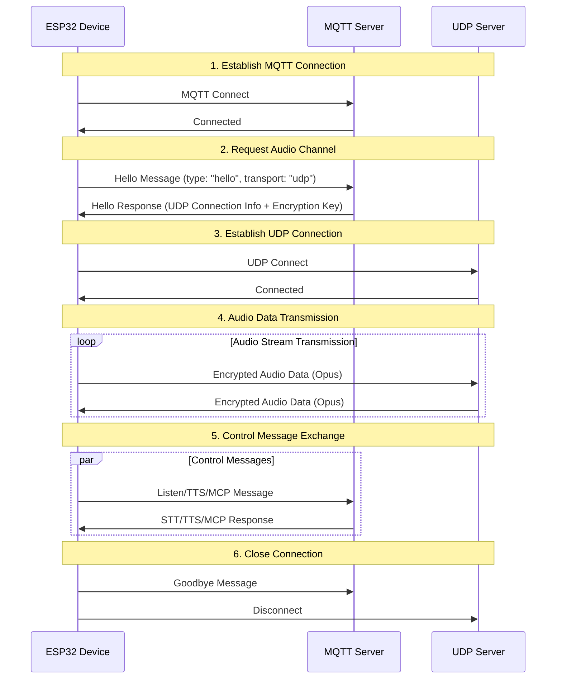
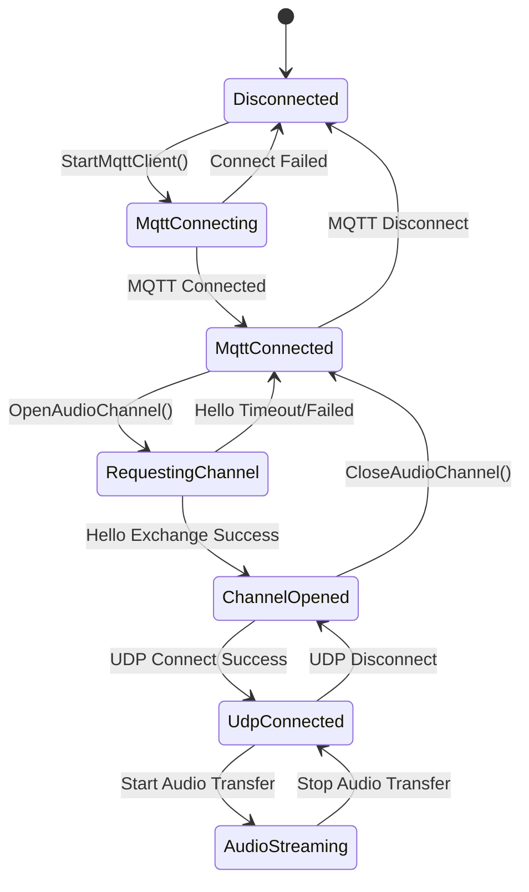
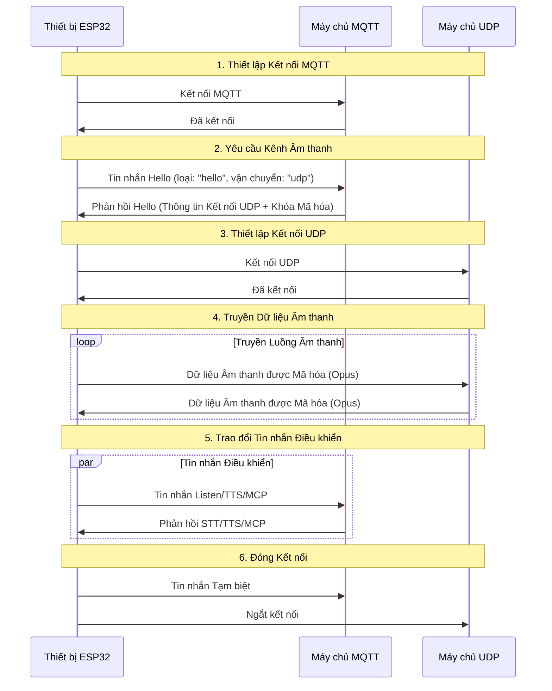
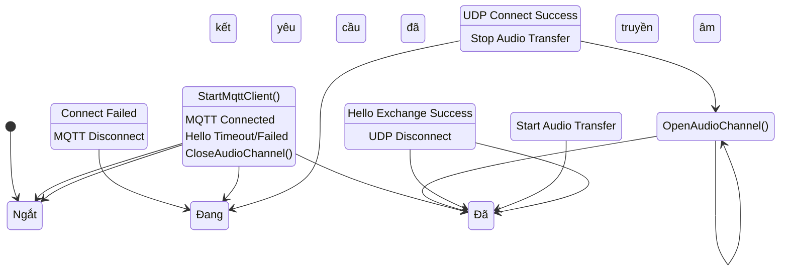

# MQTT + UDP Hybrid Communication Protocol Document

This document, organized based on code implementation, outlines the MQTT + UDP hybrid communication protocol. It describes how devices and servers interact, using MQTT for control message transmission and UDP for encrypted audio data transmission.

---

## 1. Protocol Overview

This protocol adopts a hybrid transmission approach:
- **MQTT**: Used for control messages, status synchronization, and JSON data exchange.
- **UDP**: Used for real-time audio data transmission, supporting encryption.

### 1.1 Protocol Features

- **Dual-channel design**: Control and data are separated to ensure real-time performance.
- **Encrypted transmission**: UDP audio data uses AES-CTR encryption.
- **Sequence number protection**: Prevents data packet replay and out-of-order delivery.
- **Automatic reconnection**: MQTT automatically reconnects when the connection is lost.

---

## 2. Overall Flow Overview



---

## 3. MQTT Control Channel

### 3.1 Connection Establishment

The device connects to the server via MQTT. Connection parameters include:
- **Endpoint**: MQTT server address and port.
- **Client ID**: Unique device identifier.
- **Username/Password**: Authentication credentials.
- **Keep Alive**: Heartbeat interval (default 240 seconds).

### 3.2 Hello Message Exchange

#### 3.2.1 Device Sends Hello

```json
{
  "type": "hello",
  "version": 3,
  "transport": "udp",
  "features": {
    "mcp": true
  },
  "audio_params": {
    "format": "opus",
    "sample_rate": 16000,
    "channels": 1,
    "frame_duration": 60
  }
}
```

#### 3.2.2 Server Responds to Hello

```json
{
  "type": "hello",
  "transport": "udp",
  "session_id": "xxx",
  "audio_params": {
    "format": "opus",
    "sample_rate": 24000,
    "channels": 1,
    "frame_duration": 60
  },
  "udp": {
    "server": "192.168.1.100",
    "port": 8888,
    "key": "0123456789ABCDEF0123456789ABCDEF",
    "nonce": "0123456789ABCDEF0123456789ABCDEF"
  }
}
```

**Field Description:**
- `udp.server`: UDP server address.
- `udp.port`: UDP server port.
- `udp.key`: AES encryption key (hexadecimal string).
- `udp.nonce`: AES encryption nonce (hexadecimal string).

### 3.3 JSON Message Types

#### 3.3.1 Device to Server

1. **Listen Message**
   ```json
   {
     "session_id": "xxx",
     "type": "listen",
     "state": "start",
     "mode": "manual"
   }
   ```

2. **Abort Message**
   ```json
   {
     "session_id": "xxx",
     "type": "abort",
     "reason": "wake_word_detected"
   }
   ```

3. **MCP Message**
   ```json
   {
     "session_id": "xxx",
     "type": "mcp",
     "payload": {
       "jsonrpc": "2.0",
       "id": 1,
       "result": {...}
     }
   }
   ```

4. **Goodbye Message**
   ```json
   {
     "session_id": "xxx",
     "type": "goodbye"
   }
   ```

#### 3.3.2 Server to Device

Supported message types are consistent with the WebSocket protocol, including:
- **STT**: Speech-to-Text results.
- **TTS**: Text-to-Speech control.
- **LLM**: Large Language Model emotional expression control.
- **MCP**: IoT control.
- **System**: System control.
- **Custom**: Custom messages (optional).

---

## 4. UDP Audio Channel

### 4.1 Connection Establishment

After receiving the MQTT Hello response, the device uses the UDP connection information to establish the audio channel:
1. Parse UDP server address and port.
2. Parse encryption key and nonce.
3. Initialize AES-CTR encryption context.
4. Establish UDP connection.

### 4.2 Audio Data Format

#### 4.2.1 Encrypted Audio Packet Structure

```
|type 1byte|flags 1byte|payload_len 2bytes|ssrc 4bytes|timestamp 4bytes|sequence 4bytes|
|payload payload_len bytes|
```

**Field Description:**
- `type`: Packet type, fixed at 0x01.
- `flags`: Flags, currently unused.
- `payload_len`: Payload length (network byte order).
- `ssrc`: Synchronization source identifier.
- `timestamp`: Timestamp (network byte order).
- `sequence`: Sequence number (network byte order).
- `payload`: Encrypted Opus audio data.

#### 4.2.2 Encryption Algorithm

Uses **AES-CTR** mode encryption:
- **Key**: 128-bit, provided by the server.
- **Nonce**: 128-bit, provided by the server.
- **Counter**: Contains timestamp and sequence number information.

### 4.3 Sequence Number Management

- **Sender**: `local_sequence_` monotonically increasing.
- **Receiver**: `remote_sequence_` verifies continuity.
- **Replay attack prevention**: Rejects data packets with sequence numbers less than expected.
- **Fault tolerance**: Allows slight sequence number jumps, logs warnings.

### 4.4 Error Handling

1. **Decryption failure**: Logs error, discards packet.
2. **Sequence number anomaly**: Logs warning, but still processes packet.
3. **Packet format error**: Logs error, discards packet.

---

## 5. State Management

### 5.1 Connection States



### 5.2 State Check

The device determines if the audio channel is available based on the following conditions:
```cpp
bool IsAudioChannelOpened() const {
    return udp_ != nullptr && !error_occurred_ && !IsTimeout();
}
```

---

## 6. Configuration Parameters

### 6.1 MQTT Configuration

Configuration items read from settings:
- `endpoint`: MQTT server address.
- `client_id`: Client identifier.
- `username`: Username.
- `password`: Password.
- `keepalive`: Heartbeat interval (default 240 seconds).
- `publish_topic`: Publish topic.

### 6.2 Audio Parameters

- **Format**: Opus.
- **Sample Rate**: 16000 Hz (device side) / 24000 Hz (server side).
- **Channels**: 1 (mono).
- **Frame Duration**: 60ms.

---

## 7. Error Handling and Reconnection

### 7.1 MQTT Reconnection Mechanism

- Automatic retry on connection failure.
- Supports error reporting control.
- Triggers cleanup process on disconnection.

### 7.2 UDP Connection Management

- No automatic retry on connection failure.
- Relies on MQTT channel for renegotiation.
- Supports connection status query.

### 7.3 Timeout Handling

Base class `Protocol` provides timeout detection:
- Default timeout: 120 seconds.
- Calculated based on last received time.
- Automatically marked as unavailable on timeout.

---

## 8. Security Considerations

### 8.1 Transmission Encryption

- **MQTT**: Supports TLS/SSL encryption (port 8883).
- **UDP**: Uses AES-CTR encryption for audio data.

### 8.2 Authentication Mechanism

- **MQTT**: Username/password authentication.
- **UDP**: Key distribution via MQTT channel.

### 8.3 Replay Attack Prevention

- Monotonically increasing sequence numbers.
- Rejects expired data packets.
- Timestamp verification.

---

## 9. Performance Optimization

### 9.1 Concurrency Control

Uses mutex to protect UDP connection:
```cpp
std::lock_guard<std::mutex> lock(channel_mutex_);
```

### 9.2 Memory Management

- Dynamic creation/destruction of network objects.
- Smart pointers manage audio data packets.
- Timely release of encryption context.

### 9.3 Network Optimization

- UDP connection reuse.
- Data packet size optimization.
- Sequence number continuity check.

---

## 10. Comparison with WebSocket Protocol

| Feature | MQTT + UDP | WebSocket |
|---|---|---|
| Control Channel | MQTT | WebSocket |
| Audio Channel | UDP (Encrypted) | WebSocket (Binary) |
| Real-time | High (UDP) | Medium |
| Reliability | Medium | High |
| Complexity | High | Low |
| Encryption | AES-CTR | TLS |
| Firewall Friendliness | Low | High |

---

## 11. Deployment Recommendations

### 11.1 Network Environment

- Ensure UDP port is reachable.
- Configure firewall rules.
- Consider NAT traversal.

### 11.2 Server Configuration

- MQTT Broker configuration.
- UDP server deployment.
- Key management system.

### 11.3 Monitoring Metrics

- Connection success rate.
- Audio transmission latency.
- Packet loss rate.
- Decryption failure rate.

---

## 12. Summary

The MQTT + UDP hybrid protocol achieves efficient audio and video communication through the following design:

- **Separated Architecture**: Control and data channels are separated, each performing its specific function.
- **Encryption Protection**: AES-CTR ensures secure audio data transmission.
- **Serialization Management**: Prevents replay attacks and out-of-order data.
- **Automatic Recovery**: Supports automatic reconnection after connection loss.
- **Performance Optimization**: UDP transmission ensures real-time audio data.

This protocol is suitable for voice interaction scenarios with high real-time requirements, but a trade-off between network complexity and transmission performance needs to be considered.

---

# Tài liệu Giao thức Truyền thông Lai MQTT + UDP

Tài liệu này, được tổ chức dựa trên việc triển khai mã, phác thảo giao thức truyền thông lai MQTT + UDP. Nó mô tả cách các thiết bị và máy chủ tương tác, sử dụng MQTT để truyền tin nhắn điều khiển và UDP để truyền dữ liệu âm thanh được mã hóa.

---

## 1. Tổng quan Giao thức

Giao thức này áp dụng phương pháp truyền tải lai:
- **MQTT**: Được sử dụng cho các tin nhắn điều khiển, đồng bộ hóa trạng thái và trao đổi dữ liệu JSON.
- **UDP**: Được sử dụng để truyền dữ liệu âm thanh thời gian thực, hỗ trợ mã hóa.

### 1.1 Tính năng Giao thức

- **Thiết kế kênh đôi**: Điều khiển và dữ liệu được tách biệt để đảm bảo hiệu suất thời gian thực.
- **Truyền tải được mã hóa**: Dữ liệu âm thanh UDP sử dụng mã hóa AES-CTR.
- **Bảo vệ số thứ tự**: Ngăn chặn phát lại gói dữ liệu và gửi không đúng thứ tự.
- **Tự động kết nối lại**: MQTT tự động kết nối lại khi mất kết nối.

---

## 2. Tổng quan Luồng Tổng thể



---

## 3. Kênh Điều khiển MQTT

### 3.1 Thiết lập Kết nối

Thiết bị kết nối với máy chủ qua MQTT. Các tham số kết nối bao gồm:
- **Endpoint**: Địa chỉ và cổng máy chủ MQTT.
- **Client ID**: Mã định danh thiết bị duy nhất.
- **Username/Password**: Thông tin xác thực.
- **Keep Alive**: Khoảng thời gian giữ kết nối (mặc định 240 giây).

### 3.2 Trao đổi Tin nhắn Hello

#### 3.2.1 Thiết bị gửi Hello

```json
{
  "type": "hello",
  "version": 3,
  "transport": "udp",
  "features": {
    "mcp": true
  },
  "audio_params": {
    "format": "opus",
    "sample_rate": 16000,
    "channels": 1,
    "frame_duration": 60
  }
}
```

#### 3.2.2 Máy chủ phản hồi Hello

```json
{
  "type": "hello",
  "transport": "udp",
  "session_id": "xxx",
  "audio_params": {
    "format": "opus",
    "sample_rate": 24000,
    "channels": 1,
    "frame_duration": 60
  },
  "udp": {
    "server": "192.168.1.100",
    "port": 8888,
    "key": "0123456789ABCDEF0123456789ABCDEF",
    "nonce": "0123456789ABCDEF0123456789ABCDEF"
  }
}
```

**Mô tả Trường:**
- `udp.server`: Địa chỉ máy chủ UDP.
- `udp.port`: Cổng máy chủ UDP.
- `udp.key`: Khóa mã hóa AES (chuỗi thập lục phân).
- `udp.nonce`: Nonce mã hóa AES (chuỗi thập lục phân).

### 3.3 Các loại Tin nhắn JSON

#### 3.3.1 Thiết bị đến Máy chủ

1. **Tin nhắn Listen**
   ```json
   {
     "session_id": "xxx",
     "type": "listen",
     "state": "start",
     "mode": "manual"
   }
   ```

2. **Tin nhắn Abort**
   ```json
   {
     "session_id": "xxx",
     "type": "abort",
     "reason": "wake_word_detected"
   }
   ```

3. **Tin nhắn MCP**
   ```json
   {
     "session_id": "xxx",
     "type": "mcp",
     "payload": {
       "jsonrpc": "2.0",
       "id": 1,
       "result": {...}
     }
   }
   ```

4. **Tin nhắn Tạm biệt**
   ```json
   {
     "session_id": "xxx",
     "type": "goodbye"
   }
   ```

#### 3.3.2 Máy chủ đến Thiết bị

Các loại tin nhắn được hỗ trợ nhất quán với giao thức WebSocket, bao gồm:
- **STT**: Kết quả Chuyển giọng nói thành văn bản.
- **TTS**: Điều khiển Chuyển văn bản thành giọng nói.
- **LLM**: Điều khiển biểu cảm cảm xúc của Mô hình Ngôn ngữ Lớn.
- **MCP**: Điều khiển IoT.
- **System**: Điều khiển hệ thống.
- **Custom**: Tin nhắn tùy chỉnh (tùy chọn).

---

## 4. Kênh Âm thanh UDP

### 4.1 Thiết lập Kết nối

Sau khi nhận được phản hồi MQTT Hello, thiết bị sử dụng thông tin kết nối UDP để thiết lập kênh âm thanh:
1. Phân tích địa chỉ và cổng máy chủ UDP.
2. Phân tích khóa mã hóa và nonce.
3. Khởi tạo ngữ cảnh mã hóa AES-CTR.
4. Thiết lập kết nối UDP.

### 4.2 Định dạng Dữ liệu Âm thanh

#### 4.2.1 Cấu trúc Gói Âm thanh được Mã hóa

```
|type 1byte|flags 1byte|payload_len 2bytes|ssrc 4bytes|timestamp 4bytes|sequence 4bytes|
|payload payload_len bytes|
```

**Mô tả Trường:**
- `type`: Loại gói, cố định là 0x01.
- `flags`: Cờ, hiện không được sử dụng.
- `payload_len`: Độ dài tải trọng (thứ tự byte mạng).
- `ssrc`: Mã định danh nguồn đồng bộ hóa.
- `timestamp`: Dấu thời gian (thứ tự byte mạng).
- `sequence`: Số thứ tự (thứ tự byte mạng).
- `payload`: Dữ liệu âm thanh Opus được mã hóa.

#### 4.2.2 Thuật toán Mã hóa

Sử dụng mã hóa chế độ **AES-CTR**:
- **Khóa**: 128-bit, được cung cấp bởi máy chủ.
- **Nonce**: 128-bit, được cung cấp bởi máy chủ.
- **Bộ đếm**: Chứa thông tin dấu thời gian và số thứ tự.

### 4.3 Quản lý Số thứ tự

- **Người gửi**: `local_sequence_` tăng đơn điệu.
- **Người nhận**: `remote_sequence_` xác minh tính liên tục.
- **Ngăn chặn tấn công phát lại**: Từ chối các gói dữ liệu có số thứ tự nhỏ hơn dự kiến.
- **Xử lý lỗi**: Cho phép nhảy số thứ tự nhẹ, ghi lại cảnh báo.

### 4.4 Xử lý Lỗi

1. **Giải mã thất bại**: Ghi lỗi, loại bỏ gói.
2. **Bất thường số thứ tự**: Ghi cảnh báo, nhưng vẫn xử lý gói.
3. **Lỗi định dạng gói**: Ghi lỗi, loại bỏ gói.

---

## 5. Quản lý Trạng thái

### 5.1 Trạng thái Kết nối



### 5.2 Kiểm tra Trạng thái

Thiết bị xác định xem kênh âm thanh có khả dụng hay không dựa trên các điều kiện sau:
```cpp
bool IsAudioChannelOpened() const {
    return udp_ != nullptr && !error_occurred_ && !IsTimeout();
}
```

---

## 6. Tham số Cấu hình

### 6.1 Cấu hình MQTT

Các mục cấu hình được đọc từ cài đặt:
- `endpoint`: Địa chỉ máy chủ MQTT.
- `client_id`: Mã định danh máy khách.
- `username`: Tên người dùng.
- `password`: Mật khẩu.
- `keepalive`: Khoảng thời gian giữ kết nối (mặc định 240 giây).
- `publish_topic`: Chủ đề xuất bản.

### 6.2 Tham số Âm thanh

- **Định dạng**: Opus.
- **Tốc độ lấy mẫu**: 16000 Hz (phía thiết bị) / 24000 Hz (phía máy chủ).
- **Số kênh**: 1 (đơn âm).
- **Thời lượng khung**: 60ms.

---

## 7. Xử lý Lỗi và Kết nối lại

### 7.1 Cơ chế Kết nối lại MQTT

- Tự động thử lại khi kết nối thất bại.
- Hỗ trợ kiểm soát báo cáo lỗi.
- Kích hoạt quá trình dọn dẹp khi mất kết nối.

### 7.2 Quản lý Kết nối UDP

- Không tự động thử lại khi kết nối thất bại.
- Dựa vào kênh MQTT để đàm phán lại.
- Hỗ trợ truy vấn trạng thái kết nối.

### 7.3 Xử lý Hết thời gian

Lớp cơ sở `Protocol` cung cấp tính năng phát hiện hết thời gian:
- Thời gian chờ mặc định: 120 giây.
- Được tính toán dựa trên thời gian nhận cuối cùng.
- Tự động đánh dấu là không khả dụng khi hết thời gian.

---

## 8. Cân nhắc Bảo mật

### 8.1 Mã hóa Truyền tải

- **MQTT**: Hỗ trợ mã hóa TLS/SSL (cổng 8883).
- **UDP**: Sử dụng mã hóa AES-CTR cho dữ liệu âm thanh.

### 8.2 Cơ chế Xác thực

- **MQTT**: Xác thực tên người dùng/mật khẩu.
- **UDP**: Phân phối khóa qua kênh MQTT.

### 8.3 Ngăn chặn Tấn công Phát lại

- Số thứ tự tăng đơn điệu.
- Từ chối các gói dữ liệu đã hết hạn.
- Xác minh dấu thời gian.

---

## 9. Tối ưu hóa Hiệu suất

### 9.1 Kiểm soát Đồng thời

Sử dụng mutex để bảo vệ kết nối UDP:
```cpp
std::lock_guard<std::mutex> lock(channel_mutex_);
```

### 9.2 Quản lý Bộ nhớ

- Tạo/hủy đối tượng mạng động.
- Con trỏ thông minh quản lý các gói dữ liệu âm thanh.
- Giải phóng ngữ cảnh mã hóa kịp thời.

### 9.3 Tối ưu hóa Mạng

- Tái sử dụng kết nối UDP.
- Tối ưu hóa kích thước gói dữ liệu.
- Kiểm tra tính liên tục của số thứ tự.

---

## 10. So sánh với Giao thức WebSocket

| Tính năng | MQTT + UDP | WebSocket |
|---|---|---|
| Kênh Điều khiển | MQTT | WebSocket |
| Kênh Âm thanh | UDP (Được mã hóa) | WebSocket (Nhị phân) |
| Thời gian thực | Cao (UDP) | Trung bình |
| Độ tin cậy | Trung bình | Cao |
| Độ phức tạp | Cao | Thấp |
| Mã hóa | AES-CTR | TLS |
| Thân thiện với Tường lửa | Thấp | Cao |

---

## 11. Khuyến nghị Triển khai

### 11.1 Môi trường Mạng

- Đảm bảo cổng UDP có thể truy cập được.
- Cấu hình quy tắc tường lửa.
- Cân nhắc NAT traversal.

### 11.2 Cấu hình Máy chủ

- Cấu hình MQTT Broker.
- Triển khai máy chủ UDP.
- Hệ thống quản lý khóa.

### 11.3 Các chỉ số Giám sát

- Tỷ lệ kết nối thành công.
- Độ trễ truyền âm thanh.
- Tỷ lệ mất gói.
- Tỷ lệ giải mã thất bại.

---

## 12. Tóm tắt

Giao thức lai MQTT + UDP đạt được giao tiếp âm thanh và video hiệu quả thông qua thiết kế sau:

- **Kiến trúc Tách biệt**: Các kênh điều khiển và dữ liệu được tách biệt, mỗi kênh thực hiện chức năng cụ thể của nó.
- **Bảo vệ Mã hóa**: AES-CTR đảm bảo truyền dữ liệu âm thanh an toàn.
- **Quản lý Tuần tự hóa**: Ngăn chặn các cuộc tấn công phát lại và dữ liệu không đúng thứ tự.
- **Phục hồi Tự động**: Hỗ trợ tự động kết nối lại sau khi mất kết nối.
- **Tối ưu hóa Hiệu suất**: Truyền UDP đảm bảo dữ liệu âm thanh thời gian thực.

Giao thức này phù hợp cho các kịch bản tương tác giọng nói có yêu cầu thời gian thực cao, nhưng cần cân nhắc sự đánh đổi giữa độ phức tạp mạng và hiệu suất truyền tải.